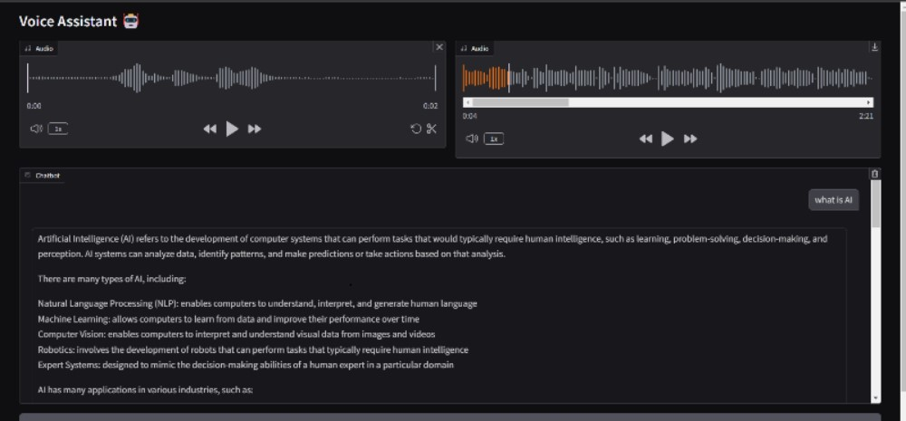

# TTS_LLM_Agent


An interactive voice chat application that combines speech recognition, large language models, and text-to-speech capabilities using Groq's Llama3 70B model and Eleven Labs voice synthesis.

## Features

- Speech-to-text conversion using Google Speech Recognition
- Natural language processing using Groq's Llama-3-70B model 
- Text-to-speech synthesis using Eleven Labs
- Interactive web interface built with Gradio

## Requirements

```shell
pip install gradio SpeechRecognition groq requests pydub
